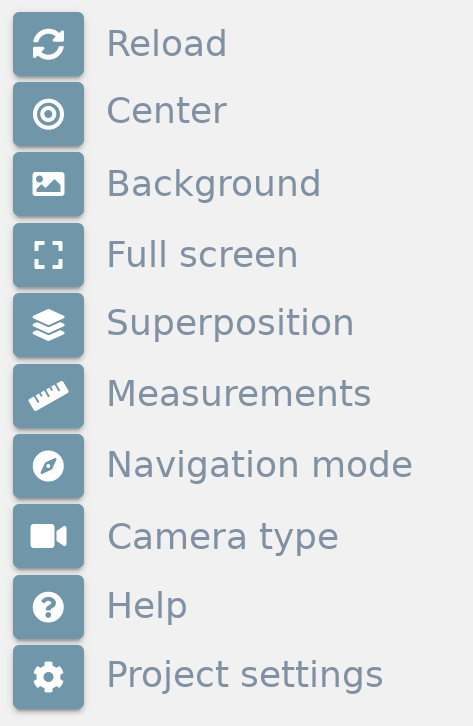
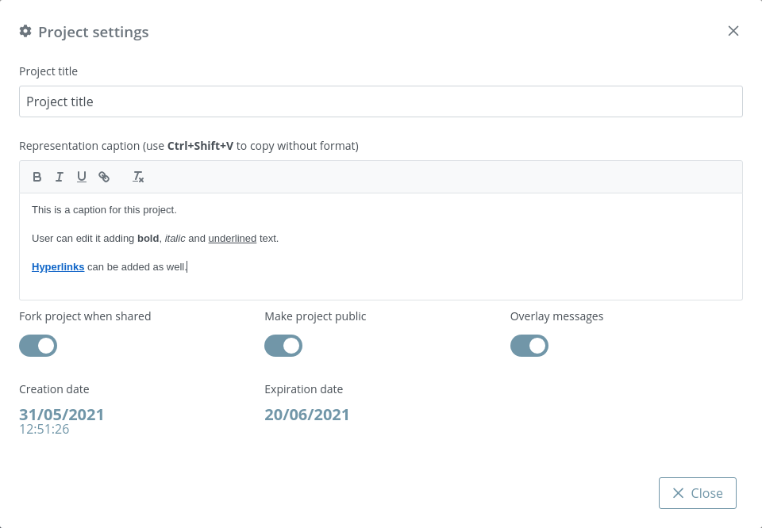
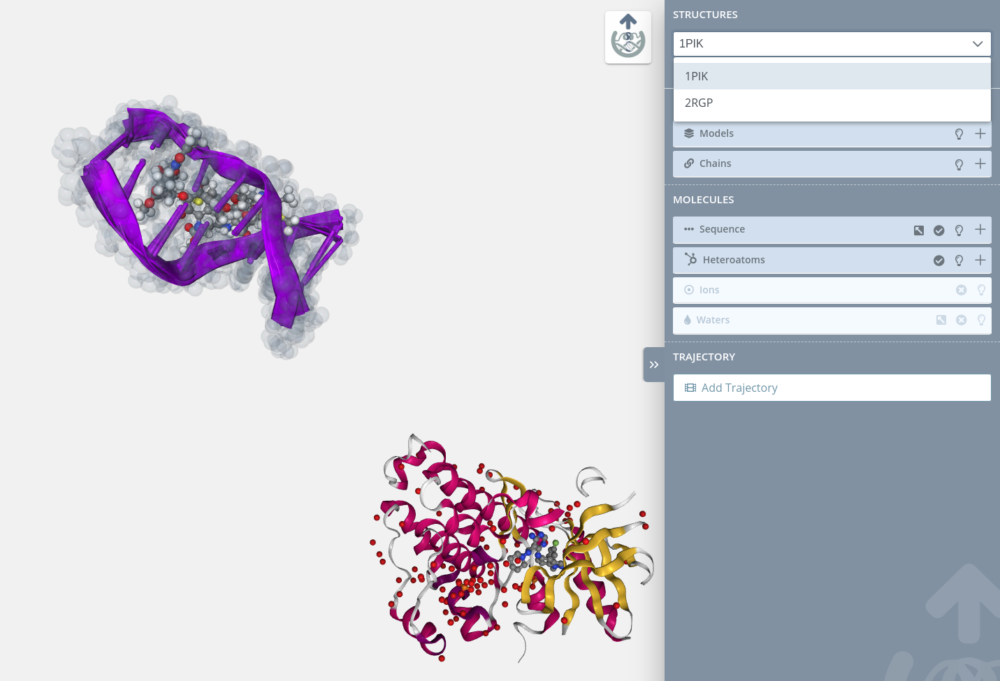
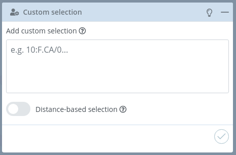
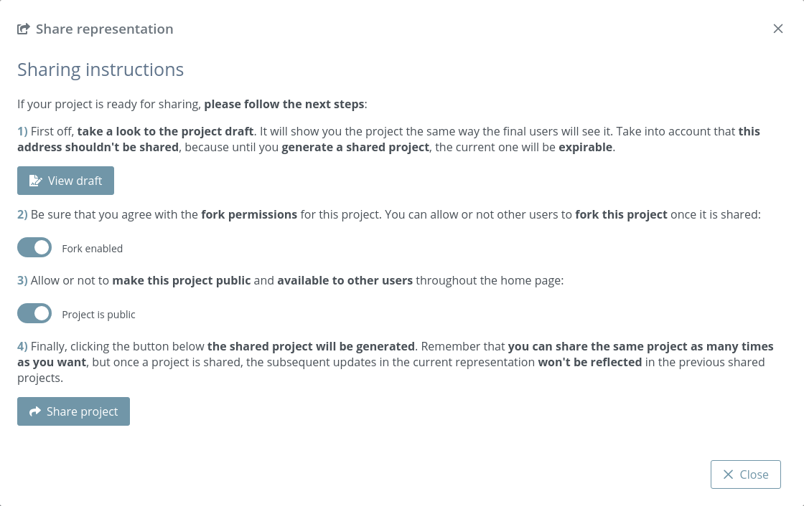
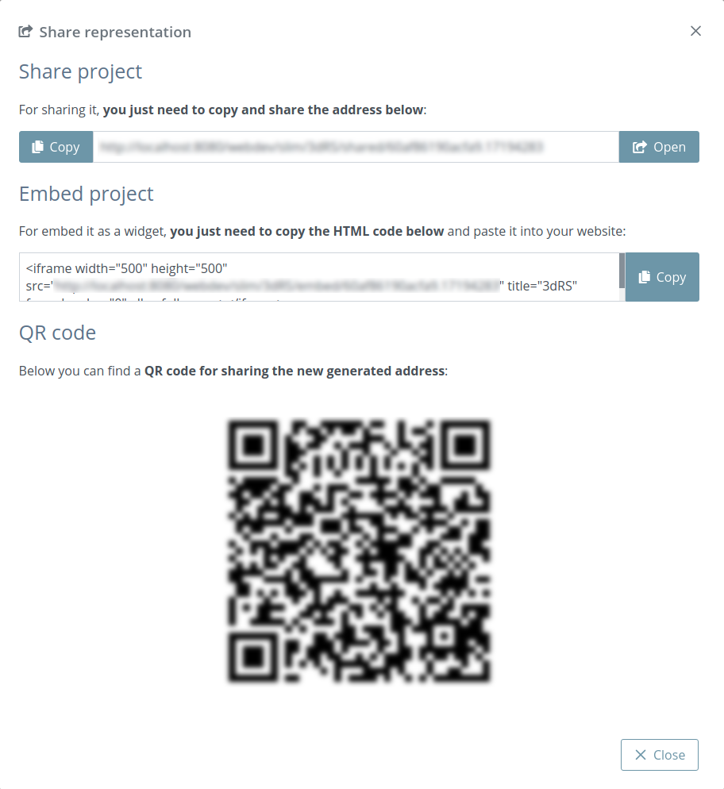

# Edit representation

Once the structure or structures are uploaded, users will be redirected to the **Edit representation page**. This page loads the structure(s) and shows a notification warning that the project will expire unless it’s shared. That means that users have **until the date shown** in the notification for editing and sharing a project. In case of not sharing it after this period of time, all the files and data related to the project will be **removed** from our database.

In the current version, the expiration time is **20 days**.

Following the philosophy of the project, this **Edit representation page** is open, but protected so that only user(s) with this URL address can access it.

This **Edit representation page** is the core of the application and we can split it into five parts:

* **[Stage](#stage)**
* **[Tools](#tools)**
* **[Representations](#representations)**
* **[Selections](#selections)**
* **[Share](#share)**

## Stage

The **stage** covers the entire screen and the rest of the parts are on top of it. In the stage the **structure is loaded** and users can interact with it in several ways. At this point it’s important to remember that **this application has no Save button**. Each change performed over the stage or panel will be **automatically saved** to the database, so anytime a user can close the browser and then come back to keep working on the edition at the same point it was.

### Zoom / Drag

Actions of **zoom in** and **zoom out** can be done with the **scroll mouse or the trackpad** of a notebook:

* Clicking **out of the structure** (that means in the “empty” part of the stage) with the **left button** and **dragging will rotate the view**.

* Clicking **out of the structure** (that means in the “empty” part of the stage) with the **right button** and **dragging will translate the view**.

* Double clicking **out of the structure** (that means in the “empty” part of the stage) with the **left button** will center the view.

### Mouse actions

#### Mouse over actions

Passing the mouse over the molecules of the structure will **highlight** them and show **their information** in the **legend** on the bottom right of the stage.

#### Mouse click actions

* Clicking with the mouse **left button** on a molecule will **select it for the current representation**. Note that the **representations are explained in the Representations section**. Only a **new representation** accepts **new molecules**. In the **default representation** no molecules can be **selected** and this feature is disabled.
* Clicking with the mouse **left button** on a molecule **while pressing the Ctrl key** will make a zoom in at a molecule.
* Clicking **consecutively on two atoms** with the mouse **right button** will draw and calculate the distance in **ångströms** between these two atoms. In the **default representation** no distances can be **created** and this feature is disabled.
* Clicking **consecutively on three atoms** with the mouse **right button while pressing the Ctrl key** will draw and calculate the angle in **degrees** between these three atoms. In the **default representation** no angles can be **created** and this feature is disabled.

### Legend

As explained in the previous section, passing the mouse over the molecules of the structure will **highlight** them and show **their information** in the **legend** on the bottom right of the stage. This legend shows information about the molecule in the next format:

> **Structure file name** | Model **number** | Chain **ID** | **Residue name (Residue long name) Residue number** Atom name (or Bond)

## Tools

The tools menu is at the top left of the **stage** and allows users to make some actions over it:

* **[Reload](#reload)**
* **[Center](#center)**
* **[Background](#background)**
* **[Full Screen](#full-screen)**
* **[Superposition](#superposition)**
* **[Measurements](#measurements)**
* **[Navigation mode](#navigation-mode)**
* **[Camera type](#camera-type)**
* **[Help](#help)**
* **[Project settings](#project-settings)**

### Reload

Clicking this button **restores the view to the initial position** on the **stage**.

### Center

Clicking this button **centers** the structure(s) position on the **stage**.

### Background

Clicking this button opens a **color picker** that allows users to change the **background color** of the **stage**.

### Full screen

Clicking this button opens the **fullscreen mode**. For **exiting** full screen mode, just **click the button again** or press the **Esc key**.

### Superposition

3dRS allows to **superpose** multiple structures **in pairs**. Clicking the Superposition button **opens a new modal dialog** with a list of **all the structures** present in the project:

As an example, **3DBQ** and **1U19** are shown before superposition:

Users must select **two structures** and specify in [NGL viewer Selection Language](https://nglviewer.org/ngl/api/manual/usage/selection-language.html) the **superposition area** of each structure. If Selection field is empty, **all the structure** will be taken as a superposition area.

After **selecting** and **clicking** the **Apply superposition button**, both structures will be superposed (in the given example, they have been superposed on the A chain):

Note that this button **only appears in case more than one structure** has been uploaded.

### Measurements

Clicking this button **opens a modal dialog** to edit the **distances and angles** created by users in the stage. For remembering how to draw them, please go back to the **[Mouse click actions section](#mouse-click-actions)**.

**Measurements** with size and color **by default**:

**Distances** before editing size and color:

**Distances** after editing size and color:

**Angles** before editing size and color:

**Angles** after editing size and color:

**Measurements** after **size and color edition**:

In the current version, distances between different structures dont work.

### Navigation mode

Sometimes it's difficult to move the stage without **accidentally selecting** a residue from it. For the sake of avoiding these problems, a **Navigation mode button** is provided. Clicking it **disables** the **selection** of molecules and the creation of **distances** and **angles**.

Once the button is clicked, it turns out its background to white and the compass icon starts **spinning**:

During the navigation mode, the mouse pointer changes its aspect to a grabbing hand:

The **Navigation mode** will be enabled until users **click the button again**.

### Camera type

Switches camera type between **orthographic** and **perspective**.

### Help

Link to this same [Read the Docs](https://3drs-documentation.readthedocs.io/en/latest).

### Project settings

Clicking this button **opens a modal dialog** to edit the **project settings**:

* **Project title:** title of the project. If this field is empty, neither title nor caption will be shown in the project once shared
* **Representation caption:** representative information of the project such as description, author(s), links and so on. Beware of copying **formatted text**, it can give problems. It's strongly reccomended to paste text without formatting (via **Ctrl+Shift+V** or **Tx** button).
* **Fork project when shared:** if enabled, the project will be able to be forked once shared. That means that anyone can make an editable copy of the project.
* **Make project public:** if enabled, the project will be shown in the home page list along with the rest of latest public projects.
* **Overlay messages:** there are notification messages for almost each action in the application. With this button they can be enabled / disabled. Note that although this option is enabled, the expiration notification will still appear as well as some error messages and the navigation mode prompt.
* **Creation date:** date of creation of the project.
* **Expiration date:** date of expiration of the project. This date will disappear once the project is shared for the first time, since then the project will be persistent.

## Representations

The **Representations** panel is at the bottom left of the stage and is used for changing the properties of the representation.

Initially, there is a **Default** representation that only allows to change the opacity and hide or show it:

Once users create a new representation, there are **all the properties** available:

### Representation actions

Below there is a description of **all the actions** that can be performed in this panel.

#### Select representation

In this dropdown menu, users can switch **between all the representations** of the project.

#### Edit representations

Below the select dropdown menu there is a tiny menu for making **some actions** over the **representations**.

##### Hide / show

**Hides** or **show** the **current representation** selected on the dropdown above.

##### Hierarchy map

Shows a **modal dialog** with all the molecules selected in **each representation**:

In the default representation this feature is disabled.

##### Edit representation name

Allows to **rename** the **current representation**:

In the default representation this feature is disabled.

##### Edit label 

Clicking this button opens the **label edition area**:

**By default**, all the actions are **disabled** until the label is **enabled** clicking the switch button.

Once the label is enabled, it will appear in the **stage** with generic size and color and centered in the current selection. Note that the **default position** varies depending on the structure and the atoms selected. Sometimes the label can be out of the selection or in a **non-representative position**. In order to fix that, a **place label button** is provided (explained below).

**Generic label** aspect:

In the **label edition area**, users can modify the label **name**, the label **size**, the label **background color** and the label **position**:

To **modify the label position**, the place label button must be clicked:

Once the button is clicked, it turns out its background to white and the crosshair icon starts **spinning**:

During this label position mode is active, the mouse pointer changes its aspect to a **crosshair**:

Note that during this mode, the **selection** of molecules and the creation of **distances** and **angles** are disabled. Picking a molecule only will translate the label to its position.

**Edited label** aspect:

In the default representation this feature is disabled.

##### Clone representation

Clicking this button will **duplicate the current representation** with the same features and selection.

In the default representation this feature is disabled.

##### Remove

**Removes** the **current representation and all the selections** linked to it. This button must be clicked **twice** in order to ensure that it has not been clicked by mistake. 

In the default representation this feature is disabled.

### Representation properties

There are several properties that can be modified for each representation.

#### Molecular representation

Each loaded **structure** can be displayed using a variety of **molecular representations**:

##### Backbone

Cylinders connect successive residues of unbroken chains by their main backbone atoms, which are **.CA** atoms in case of proteins and **C4'/C3'** atoms for RNA/DNA, respectively. The main backbone atoms are displayed as spheres.

##### Ball and stick

Atoms are displayed as spheres (balls) and bonds as cylinders (sticks).

##### Cartoon

The main backbone atoms (see backbone) of successive residues in unbroken chains are connected by a smooth trace. The trace is expanded perpendicular to its tangent with an elliptical cross-section. The major axis points from **.CA** in the direction of the .O in case of proteins and from the **C1'/C3'** to **C2'/O4'** for RNA/DNA, respectively.

If RNA/DNA an **additional base representation** is added: simplified display of RNA/DNA nucleotides, best used in conjunction with a cartoon representation. Here, a stick is drawn connecting the sugar backbone with a nitrogen in the base (**.N1** in case of adenine or guanine, **.N3** in case of thymine or cytosine).

##### Hyperball

A derivate of the **[ball+stick](#ball-and-stick)** representation (pioneered by [HyperBalls](http://sourceforge.net/projects/hyperballs/) project) in which atoms are smoothly connected by an elliptic hyperboloid.

##### Licorice

A variant of the **[ball+stick](#ball-and-stick)** representation where balls and sticks have the same radius.

##### Line

Bonds are displayed by a flat, unshaded line.

##### Ribbon

A thin ribbon is displayed along the main backbone trace.

##### Rope

A rope-like protein fold abstraction well suited for coarse-grained structures. In this representation a tube follows the center points of local axes. The result is similar to what is shown by the [Bendix tool](http://sbcb.bioch.ox.ac.uk/Bendix/).

##### Spacefill

Atoms are displayed as a set of space-filling spheres.

##### Surface

Displays the molecular surface and its variants.

##### Trace

A flat, unshaded line is displayed along the main backbone trace.

##### Tube

Essentially like **[cartoon](#cartoon)** but with the aspectRatio fixed at a value of 1.0.

Due to a shortcoming of NGL Viewer, the **cartoon** and **ribbon** representations only can show **four or more** consecutive residues.

The **Default** representation can’t be edited but represents the structure in a standard way:

* Backbone: **Cartoon** representation.
* NA bases (if present): **Base** representation.
* Heteroatoms: **Ball and stick** representation.
* Ions: **Ball and stick** representation.
* Waters: **Ball and stick** representation.

So take into account that if for example there is an heteroatom with **ATOM** instead of **HETATM** in the PDB file, it won’t be shown in this **Default** representation. 

#### Radius

Through this slider, the **radius** can be modified in the next molecular representations:

* Backbone
* Ball and stick
* Licorice
* Spacefill

#### Color scheme

Each loaded structure can be displayed using a variety of **color schemes**:

##### Atom index

Color by atom index.

##### B-factor

Color by b-factor.

##### Chain id

Color by chain id.

##### Chain index

Color by chain index.

##### Element

Color by chemical element.

##### Hydrophobicity

Color by hydrophobicity.

##### Model index

Color by model index.

##### Random

Class by random color.

##### Residue index

Color by residue index.

##### Residue name

Color by residue name.

##### Secondary structure

Color by secondary structure.

##### Uniform

Color by uniform color selected from the color picker that appears at right of the dropdown menu when this option is selected.

The colors for the **Default** representation are as follows:

* Backbone: **Secondary structure** color scheme.
* NA bases (if present): **Residue name** color scheme.
* Heteroatoms: **Element** color scheme.
* Ions: **Element** color scheme.
* Waters: **Element** color scheme.

#### Opacity

Through this slider, the **opacity** of the representation varies. Note that due to an incompatibility of NGL Viewer, opacity in multilayer projects can generate some **issues**. So creating multiple representations with different degrees of opacity can give **non desired outcomes**.

Moreover, if the opacity of a representation is **less than 30** it won’t be possible to select the residues from the stage. Due to a WebGL problem, the threshold for allowing selections from stage is set to **greater than 30**.

### New representation

In this text box, users should insert the name for **creating a new representation**. For the sake to clearly see all the items that can be selected in the representation, **initially a line representation will be shown** (see image below). But at the moment that some molecule is selected, the rest of molecules will **disappear** from the stage. See **[next section](#selections)** for a more detailed description of this behavior.

## Selections

The **Selections** panel is at the right side of the stage and is used for applying selections to the current representation selected in the **[Representations](#representations)** panel.

Note that if the current representation is the **Default** one, this panel will be disabled. Once users create a new representation, the **Representations** panel will open automatically though it can be closed clicking the open / close button.

When a **new representation** is created, all the items in the stage will be selected by default with a **Line** representation and **Secondary structure** color scheme. The meaning of this is to easily glimpse **all the molecules** contained in the representation. Once the **first molecule** (one of Sequence, Heteroatoms, Ions or Waters) is selected, this one will be the only one selected.

The **Selections** panel is divided into ten parts:

* **[Open / close button](#open-close-button)**
* **[Structures](#structures)**
* **[Custom selection](#custom-selection)**
* **[Models](#models)**
* **[Chains](#chains)**
* **[Sequence](#sequence)**
* **[Heteroatoms](#heteroatoms)**
* **[Ions](#ions)**
* **[Waters](#waters)**
* **[Trajectories](#trajectories)**

### Open / close button

This button, located at the left part of the **Selections** panel, allows to **open or close** it.

In the default representation this feature is disabled.

### Structures

#### Select structure

In this dropdown menu, users can switch between the different structures uploaded in the **[Launch project](launch.html)** page.

Opening the dropdown menu and **passing the mouse** over the structures contained on it will **highlight** them in the stage:

If there is only a **single structure**, this dropdown menu will be disabled:

#### Structures menu

Below the dropdown menu there are a couple of buttons:

##### Center structure

Centers the **stage** view in the currently **selected structure**. Note that if there is only a portion of the structure selected, the view will center around **this portion**.

##### Custom selection / Manual selection

As explained **[later on](#custom-selection)**, advanced users can make custom selections using [NGL viewer Selection Language](https://nglviewer.org/ngl/api/manual/usage/selection-language.html). When custom selection is clicked, **only this panel will be shown** in the molecules part of the **Structures panel**. For coming back to the **manual selection** just click the same button again:

### Custom selection

For accessing this section, the **Custom selection** button of the **Structures menu** must be clicked.

In this block, users can add a custom selection written in [NGL viewer Selection Language](https://nglviewer.org/ngl/api/manual/usage/selection-language.html). Please visit the [Selection language](https://nglviewer.org/ngl/api/manual/usage/selection-language.html) section of the NGL Viewer manual **before starting** with this section.

There is a mini menu at the right side of the block header:

* **Show tips:**  opens a modal dialog with a short help for this section
* **Show / hide block:**  allows to open or collapse the panel.

Two actions can be performed after writing the custom selection:

#### Save

Clicking this button the **custom selection** is added to the **current representation**.

#### Remove

Clicking this button the **custom selection** is removed from the **current representation**.

Note that **custom selection is not compatible with manual selection**, so even though the selections made in the manual selection section will not be removed, they won’t be visible in the stage. If users want to **restore a previously made manual selection**, just removing the custom selection will do the trick.

### Models

If the selected structure has **more than one model**, this block will be enabled allowing users to **switch between the different models** of the structure.

Same heteroatom in **different models** represented in three different colors:

There is a mini menu at the right side of the block header:

* **Show tips:**  opens a modal dialog with a short help for this section
* **Show / hide block:**  allows to open or collapse the panel.

Note that **switching between models will change the succeeding panels** (i.e. if the Model 1 has two chains A and B and the Model 2 has three chains A, B and C, the Chains block will change).

If there is only a **single model**, this block menu will be disabled:

### Chains

If the selected model of the current structure has **more than one chain**, this block will be enabled allowing users to **switch between the different models** of the structure.

Two **different chains** represented in two different colors:

There is a mini menu at the right side of the block header:

* **Show tips:**  opens a modal dialog with a short help for this section
* **Show / hide block:**  allows to open or collapse the panel.

Opening the dropdown menu and **passing the mouse** over the chains contained on it will highlight them in the stage:

Note that if the structure has **no chains**, all the molecules will be automatically assigned to the **Chain A**. If the structure has **one or more chains** but some of its molecules have **no chain**, these “orphan” molecules will be assigned to a **mock Chain @**.

If there is only a single chain, this block menu will be disabled:

### Sequence

There are **two ways** to perform sequence residues selection: directly through **[the block in the Selection panel](#selection-panel-block)** or though the **[Zoom window](#zoom-window)**:

#### Selection panel block

This block shows **all the residues of the structure** classified by chains.

There is a mini menu at the right side of the block header:

* **Open / close external window:**  allows to open or close the Zoom window for this section.
* **Select / unselect all:**  allows to select or unselect all the molecules of this block with a single click.
* **Show tips:**  opens a modal dialog with a short help for this section
* **Show / hide block:**  allows to open or collapse the panel.

Different actions can be performed with the residues:

##### Highlight

Passing the **mouse over** a residue will **highlight it** on the stage:

##### Selection

**Clicking on a residue** will select it in the current selection **applying to it** the molecular representation, radius, color scheme and opacity selected in the representations panel for the **current representation**:

##### Unselection

**Clicking on a selected residue** will unselect it from the current selection.

##### Zoom

**Clicking on a residue** with the mouse **left button while pressing the Alt key** will do a zoom to the residue:

##### Multiple selection

For **selecting multiple residues** just click the first residue of the custom sequence with the mouse **left button while pressing the Shift key**. A small cross will be shown next to the mouse pointer:

Then, click the last residue of the custom sequence again with the mouse **left button while pressing the Shift key**:

##### Multiple unselection

For **unselecting multiple residues** is exactly the same process: just click the first residue of the custom sequence with the mouse **left button while pressing the Shift key**. A small cross will be shown next to the mouse pointer:

Then, click the last residue of the custom sequence again with the mouse **left button while pressing the Shift key**.

Note that **multiple selections** are only **allowed** between residues of the **same Model and Chain**. Trying to select multiple residues from **different Model and / or Chain** will show an **error notification**:

If there are **no residues** in the selected structure (i.e. an heteroatom), this block menu will be disabled:

#### Zoom window

This window shows the same information of the **[Sequences block](#selection-panel-block)** but in a little more detail, adding the **ability** of selecting **α-helices** and **β-sheets** if they are present in the structure.

There is a mini menu at the right side of the window:

* **Select / unselect all:**  allows to select or unselect all the molecules of this block with a single click.
* **Close window:**  closes the window.

Different actions can be performed with the residues:

##### Residue highlight

Passing the **mouse over** a residue will **highlight** it in the stage:

##### Residue selection

**Clicking on a residue** will select it in the current selection **applying to** it the molecular representation, radius, color scheme and opacity selected in the representations panel for the **current representation**:

##### Residue unselection

**Clicking on a selected residue** will **unselect** it from the current selection.

##### Residue zoom

**Clicking on a residue** with the mouse **left button while pressing the Alt key** will do a zoom to the residue:

##### Multiple residue selection

For **selecting multiple residues** just click the first residue of the custom sequence with the mouse **left button while pressing the Shift key**. A small cross will be shown next to the mouse pointer:

 

Then, click the last residue of the custom sequence again with the mouse **left button while pressing the Shift key**:

##### Multiple residue unselection

For **unselecting multiple residues** is exactly the same process: just click the first residue of the custom sequence with the mouse **left button while pressing the Shift key**. A small cross will be shown next to the mouse pointer:

 

Then, click the last residue of the custom sequence again with the mouse **left button while pressing the Shift key**.

##### α-helix / β-sheet highlight

Passing the **mouse over** an α-helix or a β-sheet will **highlight it** in the stage:

##### α-helix / β-sheet selection

**Clicking on a α-helix or a β-sheet** will select it in the current selection **applying to it** the molecular representation, radius, color scheme and opacity selected in the representations panel for the **current representation**:

##### α-helix / β-sheet unselection

**Clicking on a selected α-helix or a β-sheet** will **unselect** it from the current selection. Note that to unselect a **whole α-helix or β-sheet** all its residues must be selected.

##### α-helix / β-sheet zoom

* **Clicking on a α-helix or a β-sheet** with the mouse **left button while pressing the Alt key** will do a zoom to the ensemble of residues:

Note that **multiple selections** are only **allowed** between residues of the **same Model and Chain**. Trying to select multiple residues from **different Model and / or Chain** will show an **error notification**:

### Heteroatoms

This block shows **all the heteroatoms of the structure**.

There is a mini menu at the right side of the block header:

* **Select / unselect all:**  allows to select or unselect all the molecules of this block with a single click.
* **Show tips:**  opens a modal dialog with a short help for this section
* **Show / hide block:**  allows to open or collapse the panel.

There is a **search box** on the top of the heteroatoms list that allows users to perform **searches** on this list.

Different actions can be performed with the heteroatoms:

#### Highlight

Passing the **mouse over** an heteroatom will **highlight** it in the stage:

#### Selection

**Clicking on an heteroatom** will select it in the current selection **applying to it** the molecular representation, radius, color scheme and opacity selected in the representations panel for the **current representation**:

#### Unselection

**Clicking on a selected heteroatom** will **unselect** it from the current selection.

#### Zoom

**Clicking on the Center button**  of each heteroatom will do a zoom on it:

If there are **no heteroatoms** in the selected structure, this block menu will be disabled:

### Ions

This block shows **all the ions of the structure**.

There is a mini menu at the right side of the block header:

* **Select / unselect all:**  allows to select or unselect all the molecules of this block with a single click.
* **Show tips:**  opens a modal dialog with a short help for this section
* **Show / hide block:**  allows to open or collapse the panel.

There is a **search box** on the top of the ions list that allows users to perform **searches** on this list.

Different actions can be performed with the ions:

#### Highlight

Passing the **mouse over** an ion will **highlight it** in the stage:

#### Selection

**Clicking on an ion** will select it in the current selection **applying to it** the molecular representation, radius, color scheme and opacity selected in the representations panel for the **current representation**:

#### Unselection

**Clicking on a selected ion** will **unselect** it from the current selection.

#### Zoom

**Clicking on the Center button** of each ion will do a zoom on it:

 
If there are **no ions** in the selected structure, this block menu will be disabled:

### Waters

There are **two ways** to perform sequence waters selection: directly through **[the block in the Selection panel](#id2)** or though the **[Zoom window](#id3)**:

#### Selection panel block

This block shows **all the waters of the structure** classified by chains.

There is a mini menu at the right side of the block header:

* **Open / close external window:**  allows to open or close the Zoom window for this section.
* **Select / unselect all:**  allows to select or unselect all the molecules of this block with a single click.
* **Show tips:**  opens a modal dialog with a short help for this section
* **Show / hide block:**  allows to open or collapse the panel.

Different actions can be performed with the water molecules:

##### Highlight

Passing the **mouse over** a water molecule will **highlight it** on the stage:

##### Selection

**Clicking on a water molecule** will select it in the current selection **applying to it** the molecular representation, radius, color scheme and opacity selected in the representations panel for the **current representation**:

##### Unselection

**Clicking on a selected water molecule** will **unselect** it from the current selection.

##### Zoom

**Clicking on a water molecule** with the mouse **left button while pressing the Alt key** will do a zoom to the water molecule:

##### Multiple selection

For **selecting multiple water molecules** just click the first water molecule of the custom sequence with the mouse **left button while pressing the Shift key**. A small cross will be shown next to the mouse pointer:

Then, click the last water molecule of the custom sequence again with the mouse **left button while pressing the Shift key**:

##### Multiple unselection

For **unselecting multiple water molecules** is exactly the same process: just click the first water molecule of the custom sequence with the mouse **left button while pressing the Shift key**. A small cross will be shown next to the mouse pointer:

Then, click the last water molecule of the custom sequence again with the mouse **left button while pressing the Shift key**.

Note that **multiple selections** are only **allowed** between water molecules of the **same Model and Chain**. Trying to select multiple water molecules from **different Model and / or Chain** will show an **error notification**:

If there are **no water molecules** in the selected structure, this block menu will be disabled:

#### Zoom window

This window shows the same information of the [**Waters block**](#id2) but in a little more detail.

There is a mini menu at the right side of the window:

* **Select / unselect all:**  allows to select or unselect all the molecules of this block with a single click.
* **Close window:**  closes the window.

The actions that can be performed are the same that in the **Waters block**:

##### Highlight

Passing the **mouse over** a water molecule will **highlight it** on the stage:

##### Selection

**Clicking on a water molecule** will select it in the current selection **applying to it** the molecular representation, radius, color scheme and opacity selected in the representations panel for the **current representation**:

##### Unselection

**Clicking on a selected water molecule** will **unselect** it from the current selection.

##### Zoom

**Clicking on a water molecule** with the mouse **left button while pressing the Alt key** will do a zoom to the water molecule:

##### Multiple selection

For **selecting multiple water molecules** just click the first water molecule of the custom sequence with the mouse **left button while pressing the Shift key**. A small cross will be shown next to the mouse pointer:

Then, click the last water molecule of the custom sequence again with the mouse **left button while pressing the Shift key**:

##### Multiple unselection

For **unselecting multiple water molecules** is exactly the same process: just click the first water molecule of the custom sequence with the mouse **left button while pressing the Shift key**. A small cross will be shown next to the mouse pointer:

Then, click the last water molecule of the custom sequence again with the mouse **left button while pressing the Shift key**.

Note that **multiple selections** are only **allowed** between water molecules of the **same Model and Chain**. Trying to select multiple water molecules from **different Model and / or Chain** will show an **error notification**:

### Trajectories

Each structure can be linked to a **trajectory**. In this section, initially there is a button that opens a modal window for uploading this **trajectory** associated with the structure.

#### Add trajectory

Clicking the button **Add trajectory** will open the modal window for uploading a trajectory:

This modal window allows **uploading a single trajectory**. Note that depending on the file size, **the process may take a while**. After uploading it to the server it will be processed through **MDsrv**.

As explained in the introduction, in the backend of this web application is running **MDsrv**, a powerful tool for viewing and sharing **molecular dynamics simulations** on the web. So once a trajectory is uploaded, MDsrv processes it in order to **stream it frame by frame**. 

For further information about **MDsrv**, please visit the [official website](https://nglviewer.org/mdsrv) or the [Nature Methods paper](https://doi.org/10.1038/nmeth.4497). 

In the current version, only **XTC**, **DCD**, **TRR**, **BINPOS** and **NETCDF** (.netcdf / .nc) formats are accepted and the maximum file size is **500MB**.

#### Player

Once the trajectory has been **uploaded and processed** in the backend, it can be played through the **trajectory player**. In this player, trajectories can be **played**, **paused** or played manually either **frame by frame** or **dragging the slider**.

#### Settings

This block allows users to modify the **trajectory settings**.

There is a mini menu at the right side of the block header:

* **Show tips:**  opens a modal dialog with a short help for this section
* **Show / hide block:**  allows to open or collapse the panel.

Different trajectory properties can be updated:

* **Range:** initially set from the first to the last frame of the trajectory, defines a **range of frames** with which the trajectory will be played.
* **Step:** defines the number of frames between playing steps.
* **Interpolation:** type of interpolation between steps. Possible values: None, Linear or Spline.
* **Timeout:** timeout between playing frames. Actually this slider is in a logarithmic scale from **50** to **10000** milliseconds, but it has been set from 0 to 100 for the sake of simplicity.
* **Loop:** if enabled plays the trajectory indefinitely.
* **Autoplay:** if enabled plays the trajectory automatically.
* **Bounce:** if enabled plays in rock / bounce mode (back and forth).

## Share

The **Share button**, located at the top right of the **stage**, opens a modal window for creating a shared version of the current project.

In this window, users must follow four steps:

### Draft

Take a look at the **project Draft**. This Draft is an exact copy of the **Shared project** so it allows users to figure how the final project will look.

Note that as a **draft version** of the final **Shared page**, some of the actions are **disabled** in this draft page: **Embed code, QR code** generation and **fork project**. The rest of the actions are **exactly the same** as in the final Shared version.

### Fork 

Be sure to agree with the **fork permissions**. Note that once the project is shared, if fork is enabled, every user with the Share representation link **will be able to fork and edit it**.

### Public 

Be sure to agree with the **public permissions**. Note that once the project is shared, if public is enabled, the shared project will be available from the Last projects list in the home page.

### Share

Finally, clicking the **Share project button** will generate a new read-only project with a different identifier. Once the button is pressed, **three new sections** will appear in the modal window.

* A text box with the **new address** with a couple of buttons for copying or opening it.
* A text box with the **embed code**. Just copy and paste this code to a new website to embed it.
* A **QR code** that opens the new address.

It’s very important to notice that **you can share the same project as many times as you want**, but once a project is shared, the subsequent updates in the current representation **won't be reflected** in the previous shared projects.