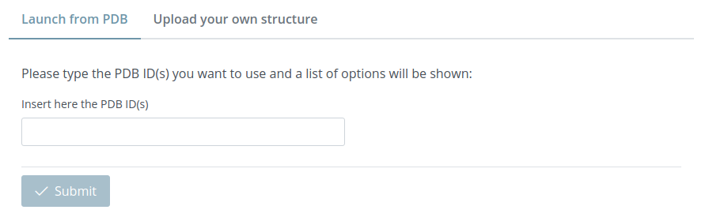
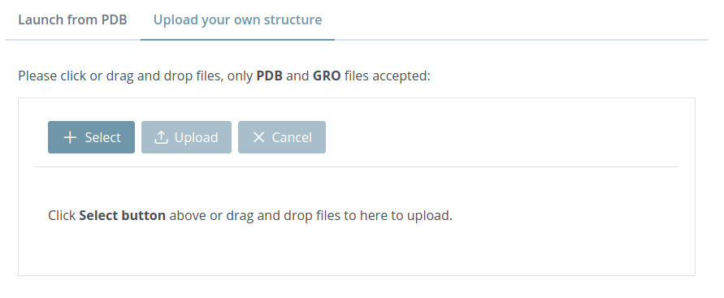

# Launch project

Go to the **[Launch](https://mmb.irbbarcelona.org/3dRS/launch)** page of the website for starting a new project. In this page there are two tabs: **Launch from PDB** and **Upload your own structure**.

## Launch from PDB

In this tab, users simply must insert one or more PDB code(s) from the **Protein Data Bank** and, once selected, click the **Submit button**. The application will automatically download the structure(s) from the **Protein Data Bank** and then the application will redirect to the new project.

## Upload your own structure

Custom structures can be uploaded from this tab just **clicking** the **Select button** or **dragging** them on the area below the submenu. Once the selection of files is ready, just clicking the **Upload** button the files will be processed by the application and then it will redirect to the new project.

Note that these custom structures **will be stored in our database** for the sake of sharing the representation later.

In the 1.0.0. version, only **PDB** and **GRO** formats are accepted and the maximum file size is **50MB**.
