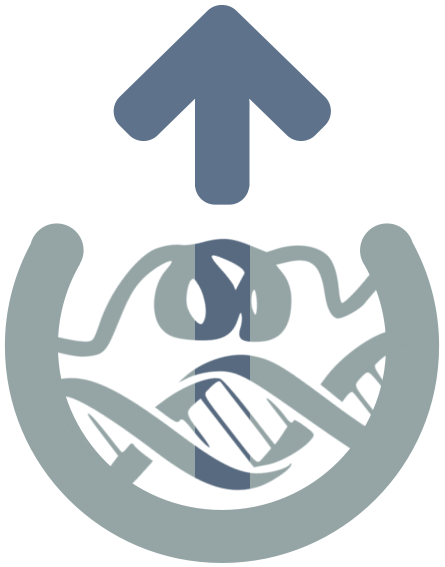

# 3dRS documentation

## Brief description

Documentation for the web application **3-dimensional structure Representation Sharing (3dRS)**. This application has been built with the aim of **sharing visualizations of 3D biological structures** through the web. In these visualizations, users will be able to draw several representations with different selections of the structure(s) previously **uploaded to the application**.

Our **philosophy for this project** is to make it accessible to everybody, so there is no private area and once a project is shared **everybody with the link can access it** with no restrictions.

For the sake of simplicity and to **improve the user experience** of the users, **this application has no *Save* button**. Each change performed over the stage or the panels will be **automatically saved** to the database, so anytime a user can close the browser and then come back to keep working on the edition at the same point it was.

**3dRS** has been built on top of **NGL Viewer** (a collection of tools for web-based molecular graphics that uses **WebGL** to display molecules like proteins and DNA/RNA with a variety of representations). **MDsrv** (a Molecular Dynamics streaming web server) has been used as well for **representing the trajectories**.

## Publication

[**3dRS, a Web-Based Tool to Share Interactive Representations of 3D Biomolecular Structures and Molecular Dynamics Trajectories**](https://doi.org/10.3389/fmolb.2021.726232)
Genís Bayarri, Adam Hospital  and Modesto Orozco .
*Front. Mol. Biosci.*, 13 August 2021, doi: [10.3389/fmolb.2021.726232](https://doi.org/10.3389/fmolb.2021.726232).

## Demo

Below there is an embedded project of [our gallery](https://mmb.irbbarcelona.org/3dRS/gallery):

<iframe width="500" height="500" src="https://mmb.irbbarcelona.org/3dRS/embed/60c1ff158a6696.79962296" title="3dRS" frameborder="0" allowfullscreen></iframe>

## Version
v1.1.1

## Documentation & help

All the documentation is accessible through [Read the Docs](https://3drs-documentation.readthedocs.io/en/latest/).

## Acknowledgements

This project has been developed on top of NGL Viewer and MDsrv:

* [NGL viewer: web-based molecular graphics for large complexes](http://dx.doi.org/10.1093/bioinformatics/bty419)
* [NGL Viewer: a web application for molecular visualization](http://dx.doi.org/10.1093/nar/gkv402)
* [MDsrv: viewing and sharing molecular dynamics simulations on the web](https://doi.org/10.1038/nmeth.4497)

## Copyright & licensing

This software has been developed by the [MMB group](https://mmb.irbbarcelona.org) at the [IRB Barcelona](https://irbbarcelona.org).

© 2021 **Institute for Research in Biomedicine**

Licensed under the **Apache License 2.0**.
