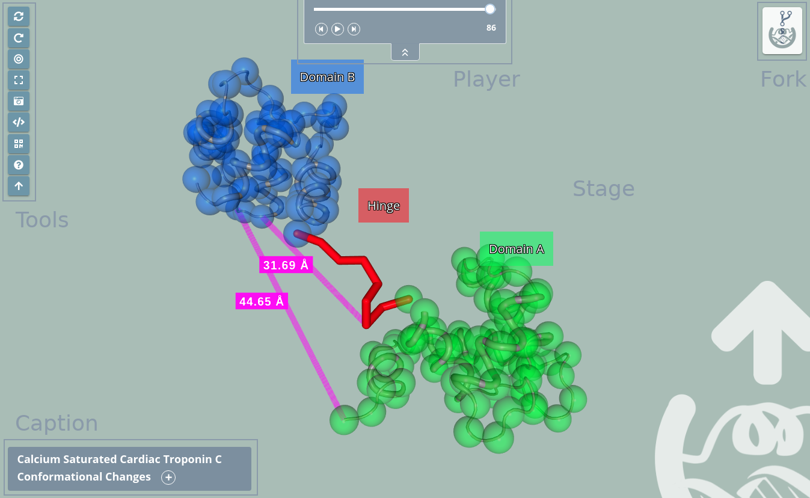

# Share representation

Once the project is shared, a new **Share representation** will be created. This is a new address different from the **Edit representation** one. This page **doesn’t expire** and we could say that it is a “read-only” version of the **Edit representation** page. That means that though it is an interactive page, the changes such as zoom or rotation are not saved.

This **Share representation page** can be splitted into five parts:

## Stage

The **stage** covers the entire screen and the rest of the parts are on top of it. In the stage the **structure is loaded** and users can interact with it in several ways. 

### Zoom / Drag

Actions of **zoom in** and **zoom out** can be done with the scroll mouse or the trackpad of a notebook:

* Clicking **out of the structure** (that means in the “empty” part of the stage) with the **left button** and **dragging will rotate the view**.

* Clicking **out of the structure** (that means in the “empty” part of the stage) with the **right button** and **dragging will translate the view**.

* Double clicking **out of the structure** (that means in the “empty” part of the stage) with the **left button** will center the view.

### Mouse actions

#### Mouse over actions

Passing the mouse over the molecules of the structure will **show their information** in the **legend** on the bottom right of the stage.

### Legend

As explained in the previous section, passing the mouse over the molecules of the structure will **show their information** in the **legend** on the bottom right of the stage. This legend shows information about the molecule in the next format:

> **Structure file name** | Model **number** | Chain **ID** | **Residue name (Residue long name) Residue number** Atom name (or Bond)

## Tools

The tools menu is at the top left of the **stage** and allows users to make some actions over it. Note that the tools of the **Shared representation** are different from the ones of the **Edit representation**.

* **[Reload](#reload)**
* **[Spin](#spin)**
* **[Center](#center)**
* **[Full Screen](#full-screen)**
* **[Take picture](#take-picture)**
* **[Player](#player)**
* **[Embed](#embed)**
* **[QR code](#qr-code)**
* **[Help](#help)**
* **[Website](#website)**

### Reload

Clicking this button **restores the view to the initial position** on the **stage**.

### Spin

Clicking this button starts / stops a **spinning animation** over the elements of the **stage**.

### Center

Clicking this button **centers** the structure(s) position on the **stage**.

### Full screen

Clicking this button opens the **fullscreen mode**. For **exiting** full screen mode, just **click the button again** or press the **Esc key**.

### Take picture

Clicking this button **takes a picture** of the **stage**. Depending on the zoom and the amount of molecules of the representation, **it can take a few seconds**. In order to get a **good resolution**, **the stage will move** during the process of taking the picture, though it will return to its **normal status** once this process is finished.

Note that if there are **representation labels** present, they will not be shown in the picture.

### Player

Only shown if there are **multiple trajectories** present in the representation, allows to **play / pause** them.

In case there is only one trajectory, it will be controlled through the **[Player panel](#id1)**.

### Embed

Opens a modal dialog with the **embed code**. Just copy and paste this code to a new website to embed it. 
 
### QR code

Opens a modal dialog with the **QR code** that opens the address of the current **Shared representation**:

### Help

Link to this same [Read the Docs](https://3drs-documentation.readthedocs.io/en/latest).

### Website

Link to the **[3dRS official web page](https://mmb.irbbarcelona.org/3dRS)**.

## Caption

The **Caption** panel is at the bottom left of the stage and shows the project title and caption  added in the **[Project Settings](edit.html#project-settings)** modal window.

If **no title** is added, the **Caption won’t be shown**.

If **no caption** is added, only the **project title** will be shown, if it’s added, a  **button** appears and allows **displaying the Caption**:

## Player

The **Player** panel is at the top of the stage and allows to control the **trajectory**. In this **player**, trajectories can be **played**, **paused** or played manually either **frame by frame** or **dragging the slider**.

If **no trajectory** is added, the **Player won’t be shown**.

In the other hand, if **more than one trajectory** is provided (in case there is more than one structure), this player **won't appear** and the control of **all the trajectories** will be performed through the Tools **[Player](#player)** button.

## Fork

If fork has been enabled in the **[Project Settings](edit.html#project-settings)** modal window or in the **[Share](edit.html#fork)** modal window, this button will appear in the top right of the stage. Clicking on it creates a new **Edit representation** page that allows editing **all the representations and selections** present in the current **Shared project**. Once the new page is created, users will be automatically redirected to it.

Be aware that **some browsers block the opening of new tabs**, so in this case, users sould manually allow this browser feature.